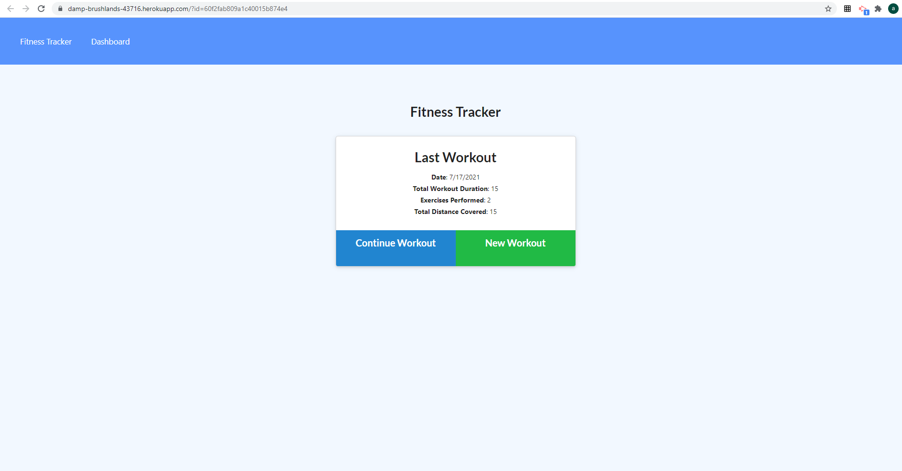
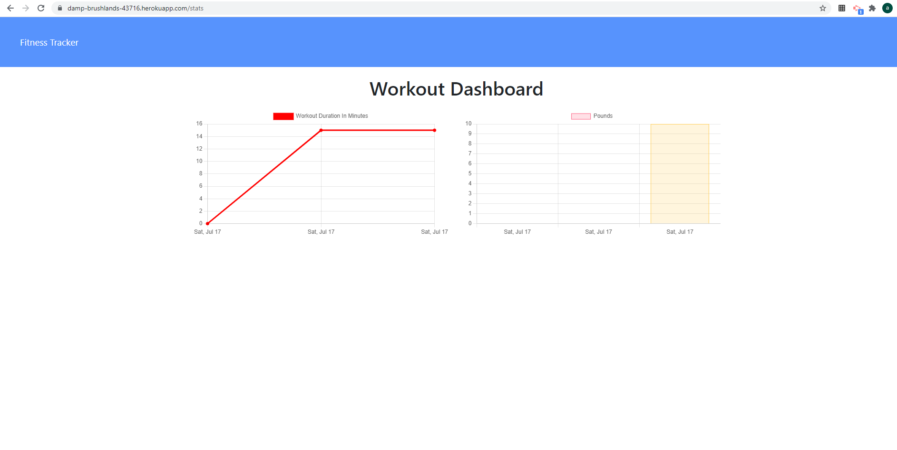
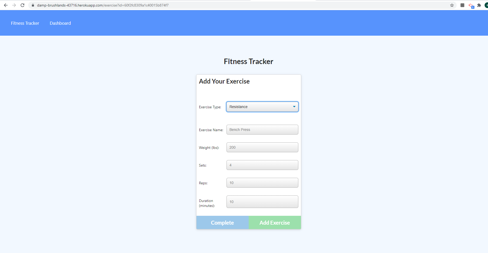

# Get Fit
[](https://damp-brushlands-43716.herokuapp.com/?id=60f2fab809a1c40015b874e4)
  
[](https://opensource.org/licenses/mit)
  
## Description
application to track fitness
  
## Table of Contents
- [Installation](#installation)
- [Usage](#usage)
- [Screenshots](#screenhots)
- [Links](#link)
- [License](#license)
- [Questions](#questions)
  
## Installation
```md
run npm i
```
  
## Usage
```md
choose between cardio or resistance then follow the prompts to create a workout 
```
  
## Screenshots



## Links
https://damp-brushlands-43716.herokuapp.com/?id=60f2fab809a1c40015b874e4
https://github.com/ashiemotto/get-fit-
  
## Reporting
```md
Github
```
## License
[](https://opensource.org/licenses/mit)
  
## Questions a
Add an issue through GitHub:
 https://github.com/Ashiemotto
  
Or using email:
Email: ashheadley@gmail.com

